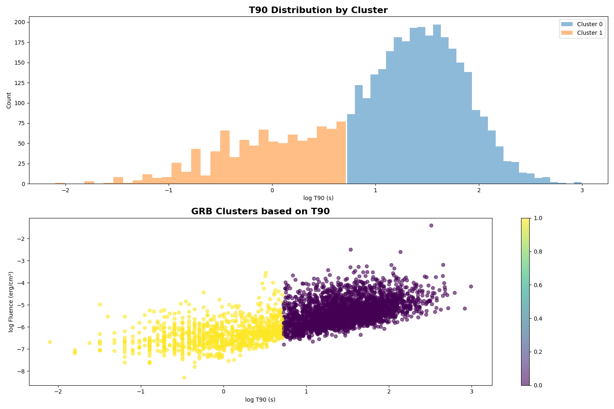
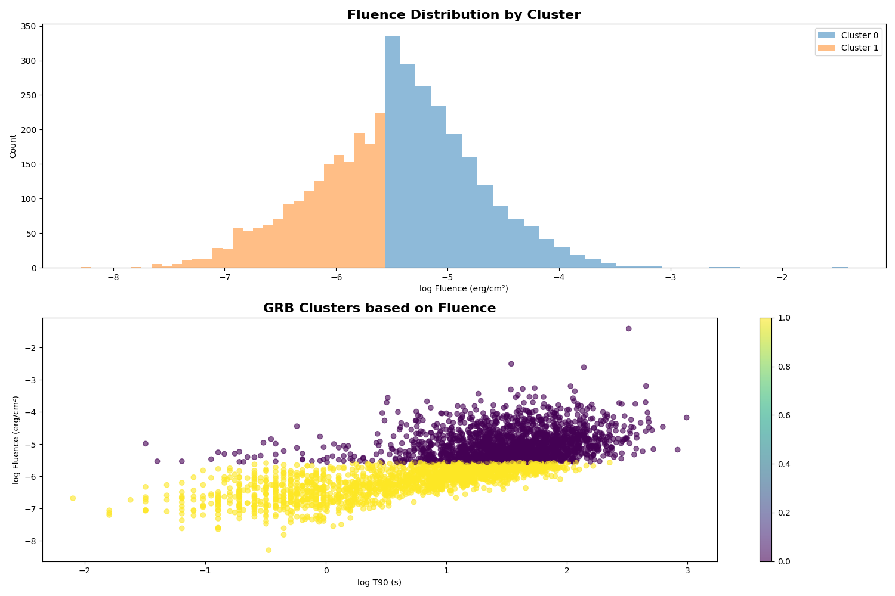

# GRB Clustering Analysis

This repository contains code and data for clustering analysis of Gamma-Ray Bursts (GRBs) based on their T90 and fluence values.

---
## Results

---

## Data Description

The `GRB_Table.csv` file contains the following columns:

1. `name`: The name of the GRB.
2. `ra`: Right Ascension of the GRB.
3. `dec`: Declination of the GRB.
4. `trigger_time`: The trigger time of the GRB.
5. `t90`: The duration in seconds during which 90% of the burst's fluence is detected.
6. `fluence`: The total fluence of the GRB in erg/cm².
7. `trigger_name`: The trigger name of the GRB.

## Usage

1. **Load and Preprocess Data**: The script reads the `GRB_Table.csv` file and preprocesses the data by converting `t90` and `fluence` to log scale.

2. **Handle Missing Values**: Rows with missing values are dropped.

3. **Clustering Analysis**:
    - Clustering based on `T90`.
    - Clustering based on `Fluence`.
    - Clustering based on both `T90` and `Fluence`.

4. **Plot and Save Results**: The script generates and saves elbow plots and clustering results.

5. **Analyze Clusters**: The script analyzes the clusters and writes the results to `output.txt`.

6. **Save Cluster Assignments**: The script saves the cluster assignments to `GRB_Table_clustered.csv`.

## Dependencies
- pandas
- numpy
- scikit-learn
- matplotlib
- seaborn